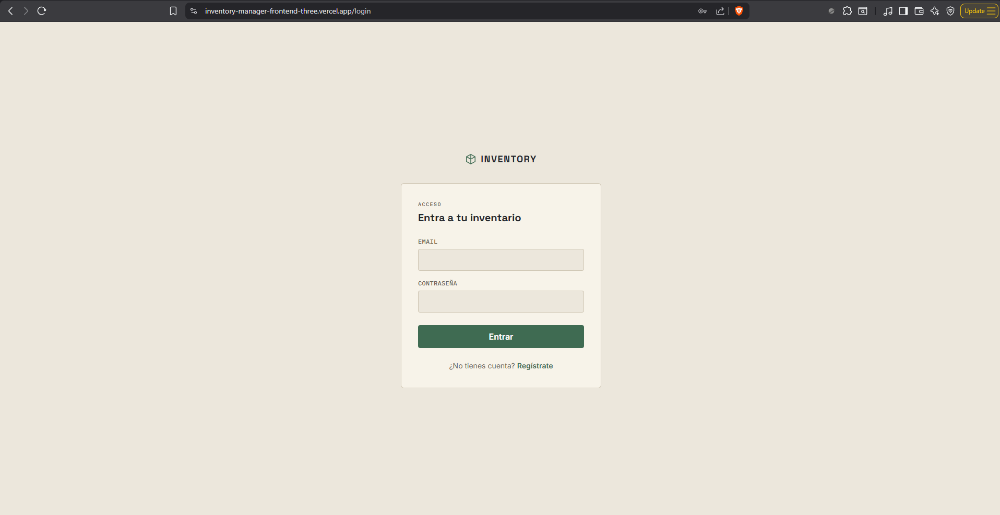
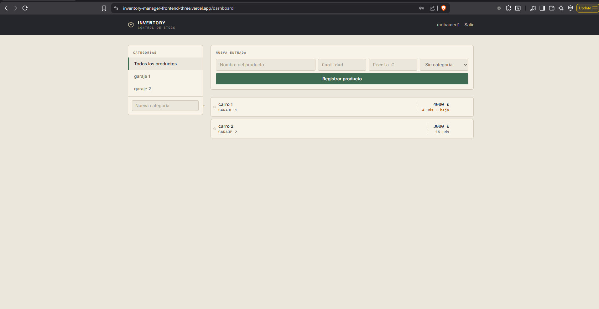

# Inventory Manager - Frontend

Interfaz para gestionar productos y categorías de inventario, conectada a una API REST propia en Spring Boot.

## Demo en vivo
https://inventory-manager-frontend-three.vercel.app

## Tecnologías
- Angular (standalone components, signals)
- Tailwind CSS
- RxJS
- Desplegado en Vercel

## Funcionalidades
- Registro e inicio de sesión
- Rutas protegidas con guards
- Gestión de categorías (crear, seleccionar, borrar)
- Gestión de productos (crear, listar, borrar, filtrar por categoría)
- Interceptor HTTP que añade el token JWT automáticamente a cada petición

## Instalación local

\`\`\`bash
git clone https://github.com/mohamedkacem0/inventory-manager-frontend.git
cd inventory-manager-frontend
npm install
ng serve
\`\`\`

La app arranca en `http://localhost:4200`, apuntando por defecto a un backend en `http://localhost:8080`.

## Backend
https://github.com/mohamedkacem0/inventory-manager-backend

### Login

### Dashboard

